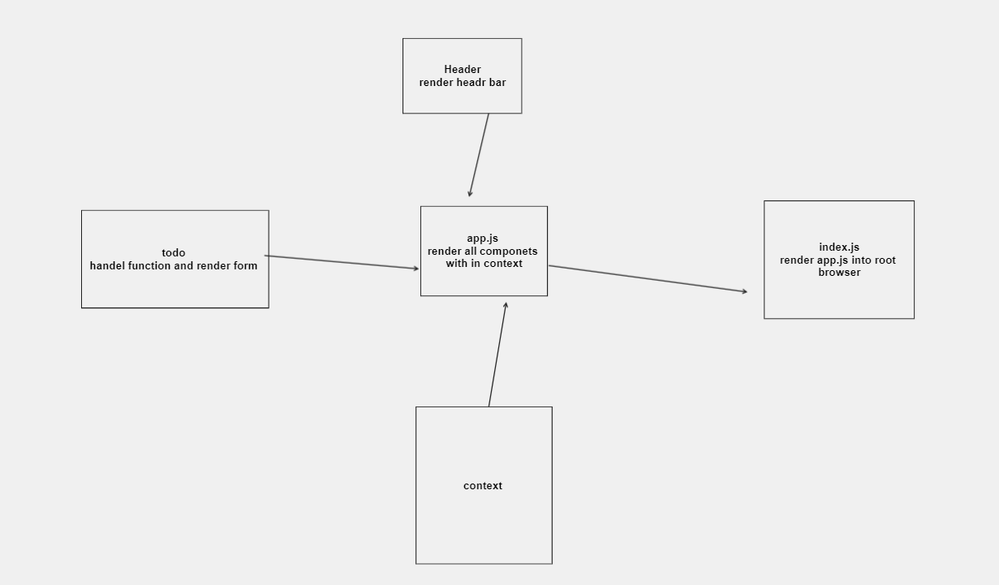

# todo-app
 ## Created by Shams Alsaraireh
 ### Phase 1 Requirements - Lab: Class 31
In Phase 1, we're going to perform some refactoring of the To Do application as built by another team. This application mixes application state and user settings at the top level and passes things around. It was a good proof of concept, but we need to make this production ready.

* Style the application using the Blueprint Component API

* Properly modularize the application into separate components

* Implement the Context API to make some basic application settings available to components

     - How many To Do Items to show at once
    - Whether or not to show completed items
## UML

## useForm()
is custom hook for managing forms with ease. It takes optional arguments. 

   ## [ToDo](https://unrivaled-speculoos-b8e01c.netlify.app/)